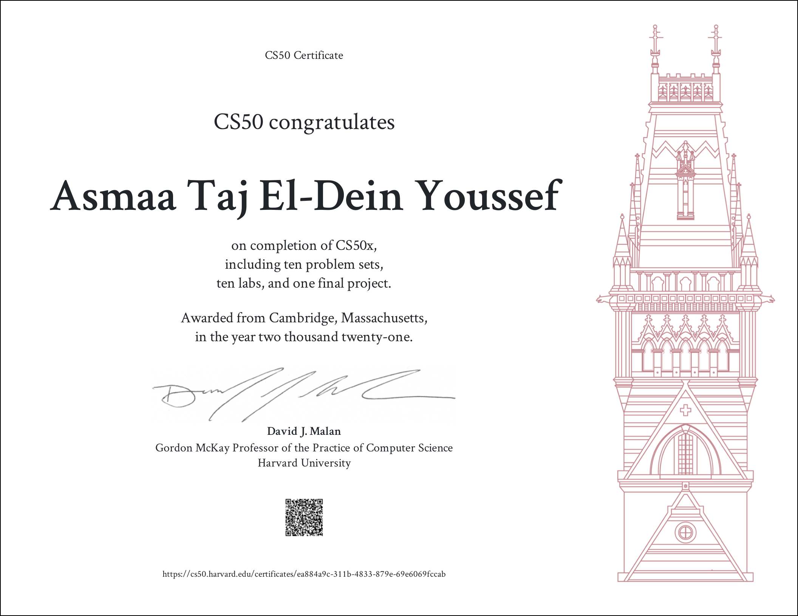

# CS50x-2020

[Certificate Link](https://certificates.cs50.io/ea884a9c-311b-4833-879e-69e6069fccab.pdf?size=letter)

These are my solutions to the problem sets of [Harvard's CS50x](https://cs50.harvard.edu/x/2020/)

> A quick word on [Academic Honesty](https://cs50.harvard.edu/x/2020/honesty/). While these solutions will help you to get through the course without too much effort, you should do your best to figure out a working solution yourself before taking a look at any of my solutions. Investing your time and energy into solving the problem sets yourself is in my opinion the only way to eventual mastery.

## Table of Contents

- [Week 0: Scratch](#week-0)
- [Week 1: C](#week-1)
- [Week 2: Arrays](#week-2)
- [Week 3: Algorithms](#week-3)
- [Week 4: Memory](#week-4)
- [Week 5: Data Structures](#week-5)
- [Week 6: Python](#week-6)
- [Week 7: SQL](#week-7)
- [Week 8: Information](#week-8)
- [Week 9: Web Track](#web-track)
- [Final Project](#final-project)

## Week 0

`[Theme: Basics of Programming]`

### Problem Set 0

- Scratch: [Milo's Space Adventure](https://scratch.mit.edu/projects/572955125)

## Week 1

`[Theme: Basics of C, Greedy Algorithm, Cryptography]`

### Problem Set 1

- [Mario (Less Comfortable Version)](pset1/mario/less.c)
- [Mario (More Comfortable Version)](week1/pset1/mario/more.c)
- [Cash](pset1/cash/cash.c)
- [Credit](pset1/credit/credit.c)

## Week 2

`[Theme: Arrays, Cryptography, Encryption]`

### Problem Set 2

- [Readability](pset2/readability/readability.c)
- [Caesar](pset2/caesar/caesar.c)
- [Substitution](pset2/substitution/substitution.c)

## Week 3

`[Theme: Algorithms, Graph Theory Basics]`

### Problem Set 3

- [Plurality](pset3/plurality/plurality.c)
- [Runoff](pset3/runoff/runoff.c)
- [Tideman](pset3/tideman/tideman.c)

## Week 4

`[Theme: Memory Organization, Pointers, Image Filters, File Manipulation & Data Recovery]`

### Problem Set 4

- [Filter (Less Comfortable Version)](pset4/filter/less/helpers.c)
- [Filter (More Comfortable Version)](pset4/filter/more/helpers.c)
- [Recover](pset4/recover/recover.c)

## Week 5

`[Theme: Data Structures]`

### Problem Set 5

- [Speller](pset5/speller/dictionary.c)

## Week 6

`[Theme: Basics of Python, Forensics, Probability]`

### Problem Set 6

- [Hello - Python](pset6/hello/hello.py)
- [Mario (Less Comfortable Version) - Python](pset6/mario/less.py)
- [Mario (More Comfortable Version) - Python](pset6/mario/more.py)
- [Cash - Python](pset6/cash/cash.py)
- [Credit - Python](pset6/credit/credit.py)
- [Readability - Python](pset6/readability/readability.py)
- [DNA](pset6/dna/dna.py)

## Week 7

`[Theme: SQLite, Database Query, Crime Investigation]`

### Problem Set 7

- [Movies](pset7/movies)
- [Fiftyville](pset7/fiftyville)

## Week 8

`[Theme: Basics of HTML, CSS, Javascript, DOM]`

### Problem Set 8

- [Homepage](pset8/homepage)

## Week 9: Web Track

`[Theme: Flask, Python, Jinja, Equity Markets(Stocks)]`

### Problem Set 9

- [Finance](pset9/finance)

## Final Project

_AstroBot 👾_

A Discord Bot for Every Space Enthusaist.

**Video Demo:** https://youtu.be/CD3tueGtBas
